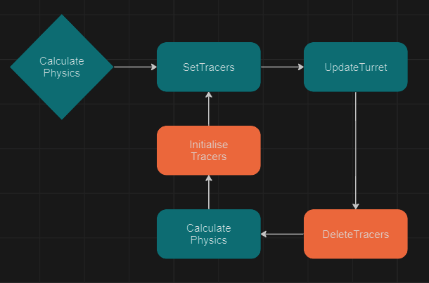
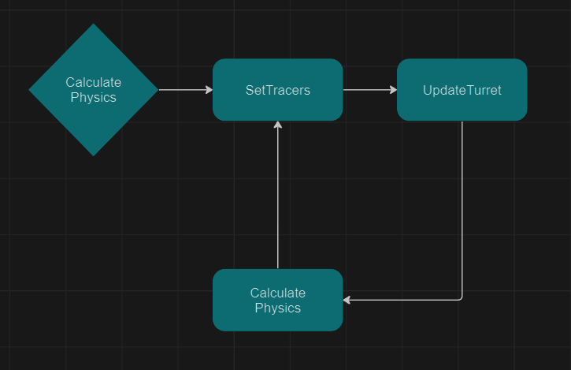

# Simple 3D predetermined projectile physics with point collisions

## Description

### Project
This project is a simple physics simulation that describes how a spherical projectile moves and collides with walls in 3D space. These physics are calculated and rendered in real time so they are adjustable by the user. With keyboard inputs the user can change the turrets angle, force, shoot projectiles and adjust the worlds gravity.

### Presentation
The calculations are rendered in a self made DirectX rasterizer that makes use of the GPU to render everything so the CPU only has to worry about the math. On the mathematical side I built upon simple 2D projectile movement to make it 3D which I then used to check intersections with the Cartesian equations of the planes in the scene. 

### Final Result

https://github.com/Howest-DAE-GD/gpp-researchtopic-WannesWD/assets/61114595/b4baf205-2bf5-47b2-981c-6c93c621e05e


## Implementation

### Math

#### 2D
I started off with a simple 2D projectile calculation:

> x = S0x + V0 * cos(α) * t
 
> y = S0y + V0 * sin(α) * t + g/2 * t^2

This equation represents the x an y position of a projectile fired from position S0 with a velocity V0 and an angle α at a given point in time t in seconds. With this you can already adjust a few variables to calculate trajectory in real time. 

https://github.com/Howest-DAE-GD/gpp-researchtopic-WannesWD/assets/61114595/431d4e21-186d-4406-834f-46b0a85efd0d


From here I combined both equations to make one equation where x serves in function of calculating y which resulted in a 2 Dimensional polynomial. (for readability S0 = (0,0))

> g / (2(V0 cos(α))²)x^2 + tan(α)x 


With this polynomial I calculated the smallest intersection point with the x axis to get the position where the projectile collided. From there you have x and y which lets you fill them in in the first formula to calculate at what time the projectile collides. 

https://github.com/Howest-DAE-GD/gpp-researchtopic-WannesWD/assets/61114595/2481d46d-2cab-4823-9a29-03f14ddff851


Once I got the intersection point and time I incremented this time by 0.01 seconds to get the projectiles movement vector to reflect it to get the outgoing movement vector and i used the time to calculate its velocity at the point of collision. Resulting in a simple 2D projectile physics simulation.

https://github.com/Howest-DAE-GD/gpp-researchtopic-WannesWD/assets/61114595/9030bc9f-ea25-4bb0-b03b-5a77f9d27860


#### 3D

To Convert the previous simulation to 3D the 2D projectile calculation needed to be slightly altered to take into account the projectiles movement in the z direction along with a second angle between the x and the z axis:

> x = S0x + V0 * cos(α) * cos(β) * t

> y = S0y + V0 * sin(α) * t + g/2 * t^2

> z = S0z + V0 * cos(α) * sin(β) * t

Now there is a problem (not really), in 2D I solved the system to create a 2D polynomial so I could calculate the intersections with the x axis but in 3D this system is pretty hard to solve and we don't only want to know the intersections with the x plane but with any plane.

So instead of trying to solve the system it is way more efficient to equate it with the Cartesian equation of a plane:

> ax + by + cz = -d

Since the Cartesian equation of a plane can easily be calculated with 3 points of a plane, a, b, c, and d are given, leaving only x, y and z which can be filled in by the equations in the system to calculate the projectile position. Resulting in another 2D polynomial: 

> (b*g)/2 t^2 + V0 * (a * cos(α) * cos(b) + b * sin(a) + c * cos(a) * sin(b)) * t + (d + a * S0x + b * S0y + c * S0z)

Solving this polynomial for the smallest positive t results in finding the point where a 3D projectile collides with a plane.

https://github.com/Howest-DAE-GD/gpp-researchtopic-WannesWD/assets/61114595/f2d5d73c-4c56-42d1-a00e-702ce4383cf3


From here I did the same thing as in 2D, with the collision time I calculate the incoming movement vector and velocity, reflect it and calculate the new angles to get the next projectile movement equation with which the same can be done to get to this point again. 

https://github.com/Howest-DAE-GD/gpp-researchtopic-WannesWD/assets/61114595/cd1852a9-8441-480c-84e4-7fefb21c3df2


There are some slight inaccuracies in the last 2 videos, for these calculations i forgot to take into account the angle between the x and z axis, resulting in the projectile not moving in the right direction. This was something i realised with the help of video 0 in my references and i was able to fix this in code. Despite these inacucuracies all other calculations where accurate. In case you wish to know more about the math or look into it yourself, there is a file with all the digital calculations i made for this project, however these might not be very readable which is why they are not included in this explanation. 

### Code

#### setup
I started with my DirectX rasterizer that loads obj files and renders them while applying shading and textures but for simplicity I made a shader for this project that only maps a texture and doesn't apply any shading.

Since my rasterizer had no support for simple shapes that are more than just triangles I had to start by making a sphere and plane class to make the code more readable and reusable. These classes just take a position and texture and apply it to a spherical an planar obj and calculate some information that I would need later (normals, Cartesian equation,...).

```
Plane::Plane(variables) :
	Initialisation
{
	DirectX Stuff..
	
	dae::Vector3 cross{ dae::Vector3::Cross(ac.Normalized(), ab.Normalized()).Normalized()};
	m_Normal = cross;
	m_CartesianCords = dae::Vector4{ cross , -(cross.x * a.x + cross.y * a.y + cross.z * a.z) };
}
```

With these simple shapes I could setup the scene and start programming the physics simulation.

#### Simulation
##### V0
First off I created a singleton class with the purpose to only calculate the physics, it started out by holding the calculated movement so it took a sphere with some angles and launch velocity. With this information it calculated the spheres movement which it then traced by placing smaller spheres along its path. 

The simulation class uses a recursive function to calculate the projectiles movement path, it felt very natural to chose a recursive pattern since calculating the path to the first intersecting point generated all the information needed to call the function again with new information.

```
void PhysicsCalculator::CalcPhysics(const dae::Vector3& startPos, std::vector<Sphere*>& projectileTrace, 
					const std::vector<Plane*>& worldPlanes, float launchForce,
					 float launchAngleA, float launchAngleB)
{
	if (abs(launchForce) < 0.1f)
	{
		return;
	}

	float minT{ FLT_MAX };

	for (Plane* plane : worldPlanes)
	{
		calculate intersection time (minT);
	}

	setPathInfo(minT);
	
	dae::Vector3 nextStartPos{ calculatePosition(startPos, minT) };

	//set projectile tracers
	SetTrace(startPos, projectileTrace, minT);		

	if ( limit amount of loops )
	{
		dae::Vector3 v1{ calculate velocity at minT };
		dae::Vector3 hitPos{ nextStartPos };
		dae::Vector3 incrementHitPos{ nextStartPos + 0.01f };
		dae::Vector3 hitVelocity{ hitPos ,nextPos };

		calculate bouncedVelocityVector();

		float nextA{ calculateNext launchAngleA };
		float nextB{ calculateNext launchAngleB };

		CalcPhysics(hitPos, projectileTrace, worldPlanes, v1.Magnitude(), nextA, nextB);
	}
}

```

In its update function it took a sphere and applied the stored movement to that sphere.

https://github.com/Howest-DAE-GD/gpp-researchtopic-WannesWD/assets/61114595/88cc8acb-6289-484b-9f21-48522f8e187a


##### V1
This worked but was not very efficient since the tracing had to create and delete spheres every time the launch angle changed and since the simulation class was storing the movement it could not be changed while a sphere was moving.

With the simulation working, all be it not very efficient, I made it more presentable and implemented input handling so it would be more dynamic. After implementing user input I realized there were a lot of scenarios where the sphere would just fall through the ground. This was caused by floating point imprecision and having to compare floats causing me to have to refactor many of my code since I could no longer just compare the variables. resulting in many parts of my code looking like this:

```
{
	...
	
	float epsilon{ 0.001f };
		
	a = (abs(cartesianCords.x) < epsilon) ? 0.f : cartesianCords.x;
	...
	
	t0 = (abs(t0) < epsilon) ? 0.f : t0;
	
	...
	
	(minT-t) > epsilon
	
	...
}

```

It did however make the simulation a lot more consistent and while it was still running into performance issues when adjusting the angle it would no longer break.

https://github.com/Howest-DAE-GD/gpp-researchtopic-WannesWD/assets/61114595/ee812665-2aad-49fb-b542-9152901bc4e6


##### FinalVersion
Having implemented all the basic functionality I wanted, I slightly altered the bounce velocity calculation to add some friction when hitting walls. Then I focused on optimizing my code so it wouldn't lag when adjusting the angle, this I fixed by implementing a memory pool for the tracers tracing the projectiles trajectory, since allocating hundreds of spheres takes a lot of resources they are now pooled. Meaning that whenever a trace is updated the tracers are not deleted but just placed in different positions, this resulted in me being able to make aiming more precise.

Going from this:



 To:
 

 
Now that there were no more performance issues there was one more thing I wanted to solve which was the fact the you could not shoot more than 1 projectile at the same time and you could not move the turret while a projectile was moving. Both these issues were caused by the physics calculator being the owner of the predicted motion. To fix this I made a projectile class that holds all the info needed to move the projectile. So now the calculator calculates the path and passes it to the projectile. Causing me to no longer have to update the projectile through the calculator class and making it possible to shoot as many projectiles as I want in any direction. Since the projectiles are also pooled they reach an equilibrium where they don't cost much performance.

https://github.com/Howest-DAE-GD/gpp-researchtopic-WannesWD/assets/61114595/b77b2f3d-1694-4fce-bc4a-99a8dc8d4ef1


## Result
This all resulted in a project that can predict and simulate multiple projectile paths in 3D space with dynamically changing angles, gravity and launch velocity. 

https://github.com/Howest-DAE-GD/gpp-researchtopic-WannesWD/assets/61114595/44833516-12d3-4580-9022-213e717542f2


Since the calculations are all relative to the spheres path it also works in different kind of scenes:


https://github.com/Howest-DAE-GD/gpp-researchtopic-WannesWD/assets/61114595/69f2c0fe-6ac1-484b-b459-da4fcf46213e


https://github.com/Howest-DAE-GD/gpp-researchtopic-WannesWD/assets/61114595/f64e146c-47cd-4069-8692-4e71c137774e


## Conclusion

My main goal for this project was to make a physics simulation with the mathematical knowledge I already had and I am happy to conclude that by doing a lot of math supported by my references, i was able to go from a simple 2D projectile trajectory to a 3D physics simulation. 

## Future Work
Overall the simulation is accurate with the given information, but due to some time constraints I had to limit the scope of the simulation so there are a few inaccuracies:

-- When hitting a wall the sphere just loses half of its velocity to simulate friction.

-- Spheres don't collide with each other.

-- If a sphere hits two walls at the exact same time it will go through one of them.

-- There is no check to see if the sphere hit within the plane since Cartesian equations represent an infinite plane.

-- Collisions are calculated as point collisions so spheres clip into planes when they collide

If I had more time I would fix/implement these issues since I have a decent idea on how to implement all of them and I would look into implementing a proper UI. 

For a more detailed look at my DirectX implementation and git history I refer to my Graphics Programming git page (specifically the DirectX part):
https://git.allpurposem.at/Wannes/GraphicsProg/src/branch/main/GP1_DirectX/source


## References
Books:
+ Animation maths, a book by Ivo de Pauw and Bieke Masselis, https://www.lannoo.be/nl/animation-maths 
+ My highschool math book, made by Johan Vanacken (given to me by him, not available online)
Video:
+ Projectile Motion 9 3D Projectile Motion, by lets code physics, https://www.youtube.com/watch?v=pIOaGRx7oys&ab_channel=Let%27sCodePhysics
